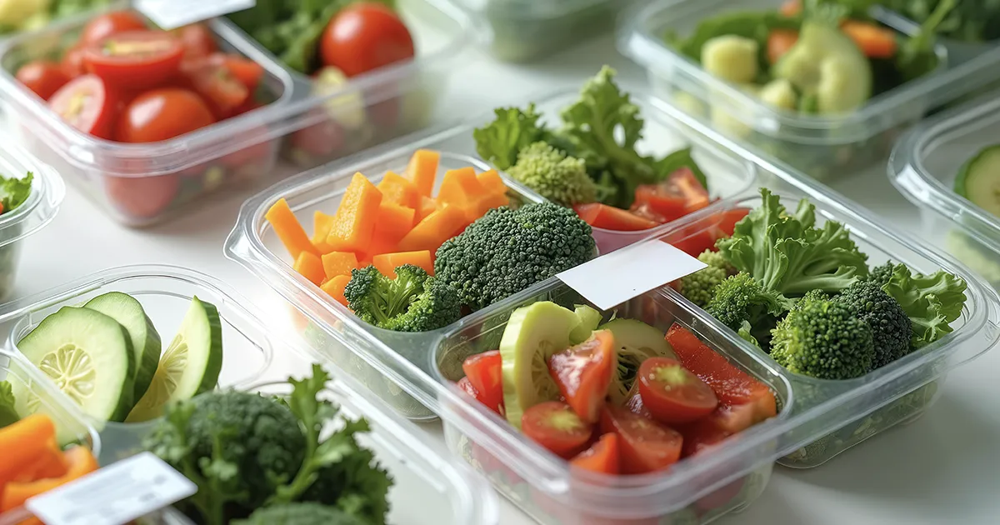

# Meal Tracker API



A simple RFID-enabled meal tracking API built with **TypeScript**, **Express**, and **Prisma**.  
Designed to log meal prep containers and track macros via RFID/NFC tags.

---

## Tech Stack
- **TypeScript**
- **Express.js**
- **Prisma ORM**
- **PostgreSQL** (Render)
- **SQLite** (local dev)
- **REST Client / Postman** for testing

---

## Deployment
This project is deployed on [Render](https://meal-tracker-api.onrender.com) using a managed PostgreSQL instance.

---

## API Endpoints

### Meals
- `GET /api/meals` — Fetch all meals
- `POST /api/meals` — Add a new meal

### Logs
- `GET /api/logs` — Fetch all logs
- `POST /api/logs` — Record a scan
- `PUT /api/logs/:id` — Update status (prepped/eaten)
- `DELETE /api/logs/:id` — Delete specific log
- `DELETE /api/logs/tag/:tagId` — Delete all logs for a tag
- `GET /api/logs/summary` — Return today's totals (protein, carbs, fats, and calories)

---

## Project Goals

The goal of this project is to develop a **proof-of-concept meal tracking system** that uses **RFID/NFC tags** to quickly log meals and track nutritional intake.

The project demonstrates how simple physical interactions (like scanning a tag) can connect to a live database and update macros in real time.  
It’s designed as a lightweight, scalable prototype suitable for future integration with mobile or wearable devices.

**Core objectives:**
- Build a Node.js + TypeScript + Express backend with a PostgreSQL database (via Prisma ORM)  
- Enable meal creation, logging, and daily summary endpoints  
- Use RFID/NFC tags to represent meals, allowing instant scan-based tracking  
- Deploy to a live environment (Render) for mobile access and real-world testing  
- Lay the groundwork for future dashboard or mobile app integration  

---

## Target Audience

This project is designed for:

- **Fitness enthusiasts** who meal prep and want to simplify macro tracking without relying on manual entry.  
- **Developers and technical learners** exploring IoT integrations, backend APIs, and real-world data handling with Prisma.  
- **Nutrition coaches or personal trainers** interested in low-friction ways for clients to record meals.  
- **Start-ups or R&D teams** investigating NFC technology for health and lifestyle products.

---

## Environment Variables

Create a `.env` file in the root directory:
DATABASE_URL="postgresql://your_connection_string_here"

---

## Setup

```bash
npm install
npx prisma migrate dev --name init
npm run dev

---

## System Overview

Meal Tag (RFID/NFC)
        ↓
     Express API
        ↓
  PostgreSQL Database
        ↓
   /api/summary Endpoint